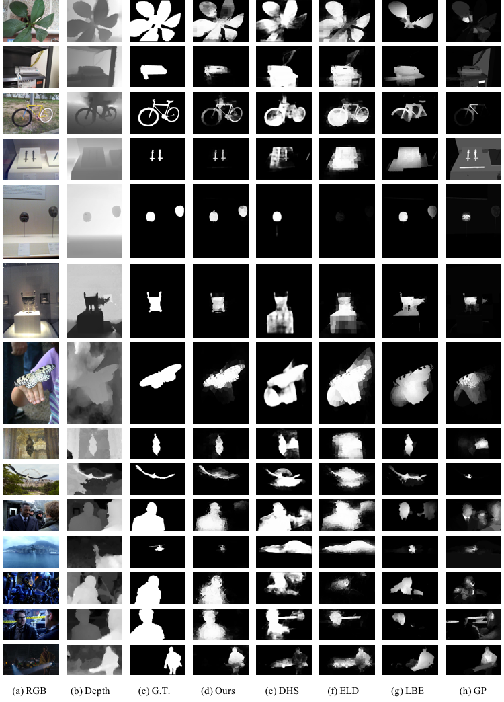

## RGBD Saliency Net


This is the source code of our paper "Learning RGB-D Salient Object Detection using background enclosure, depth contrast, and top-down features".

Our code is implemented based on [ELDNet](https://github.com/gylee1103/ELDNet) which is RGB saliency detection system. We also make use of [gSLICr](https://github.com/carlren/gSLICr) in our system.

## Usage
- **Supported OS**: We tested our code on Ubuntu 14.04.

- **Dependencies**: Basically see [Caffe installation](http://caffe.berkeleyvision.org/install_apt.html). We tested our code on CUDA 8.0, OpenCV 3.0.0.

- **Installation**

  1. We added scripts to original caffe. Please build our version caffe using CMake:

    ```shell
    # execute these command at the root of this directory
    cd caffe && mkdir build && cd build
    cmake ..
    make -j8
    ```

  1. Adjust library paths in CMakeList.txt and build code for test.

    ```shell
    # execute these command at the root of this directory
    edit CMakeList.txt
    mkdir build && cd build
    cmake ..
    make
    ```

- **Run demo program**

  ```shell
  # execute this command at the root of this directory
  ./build/get_results RGBDNet_test.prototxt RGBD1000.caffemodel test_rgb/ test_depth/ test_fill/ test_gap/ results/
  ```
If you want to test NJUDS2000 dataset images, please use NJUDS2000.caffemodel.

## Results in our paper



## Citing our work
Please kindly cite our work if it helps your research:

  ```shell
  @article{DBLP:journals/corr/ShigematsuFYB17,
    author    = {Riku Shigematsu and
                 David Feng and
                 Shaodi You and
                 Nick Barnes},
    title     = {Learning {RGB-D} Salient Object Detection using background enclosure,
                 depth contrast, and top-down features},
    journal   = {CoRR},
    volume    = {abs/1705.03607},
    year      = {2017},
    url       = {http://arxiv.org/abs/1705.03607},
    timestamp = {Wed, 07 Jun 2017 14:42:30 +0200},
    biburl    = {http://dblp.uni-trier.de/rec/bib/journals/corr/ShigematsuFYB17},
    bibsource = {dblp computer science bibliography, http://dblp.org}
  }
  ```
